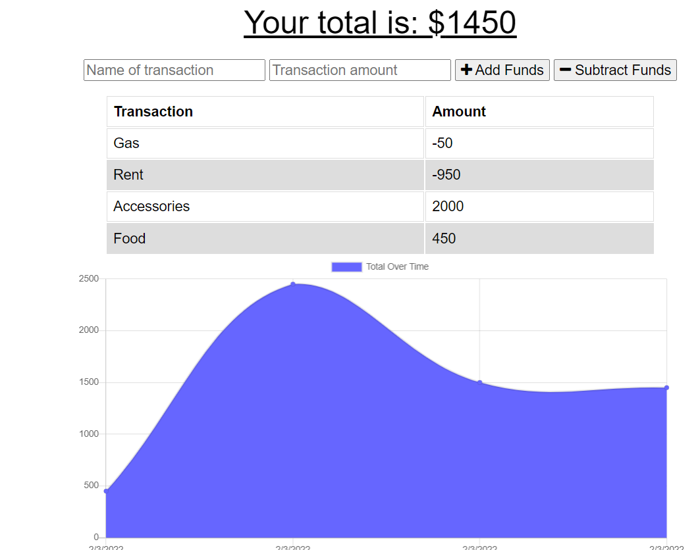

# PWA - Budget Tracker

## Description

This is a Budget Tracker application that has been developed as a progressive web app that will allow for for offline access and functionality. Regardless of whether or not the user has an online connection, they will be able to utilize this app. The user can track their budget in real time by either depositing or debiting money based on transactions. If the user has an online or offline connection this will constantly update the database as well as the UI. This application allows users a fast and easy way to track their finances by allowing users to access that information on and offline. Having offline functionality is paramount to the success of an application that handles users’ financial information

## Notes
This application uses the following Node.js packages:
- [express](https://expressjs.com/)
- [mongoose](https://www.npmjs.com/package/mongoose)
- [morgan](https://www.npmjs.com/package/morgan)
- [compression](https://www.npmjs.com/package/compression)

This application takes advantage of the following technologies:
- [progressive web app](https://web.dev/progressive-web-apps/)
- [web app manifest](https://web.dev/add-manifest/)
- [service worker](https://developer.mozilla.org/en-US/docs/Web/API/Service_Worker_API)
- [indexed db](https://developer.mozilla.org/en-US/docs/Web/API/IndexedDB_API)

## Instructions

## Application Screenshots

## Contributing
Nicole Mitchell
github: https://github.com/NicolePM/